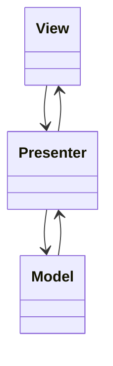
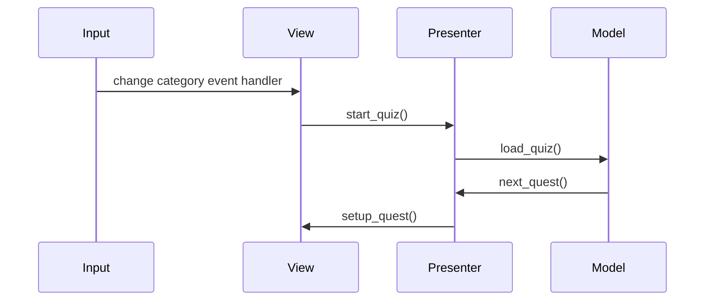
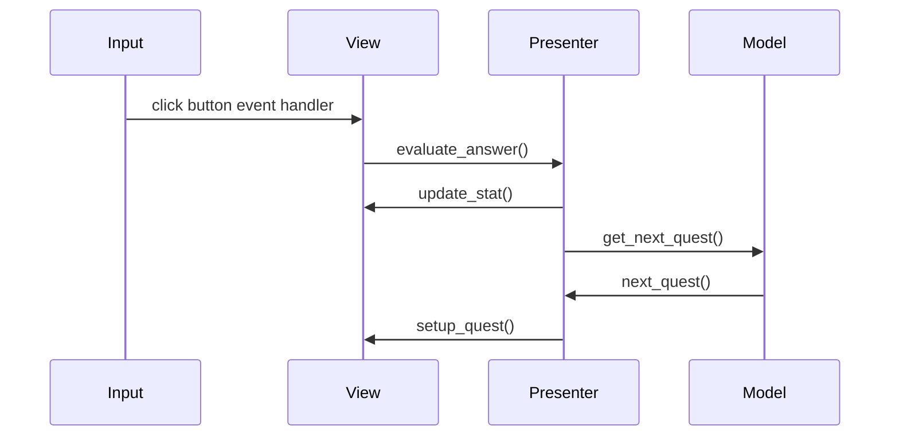

# Model View Presenter Architecture

```mermaid
classDiagram

  class View
  class Presenter
  class Model

  View --> Presenter
  Presenter --> View
  Presenter --> Model
  Model --> Presenter
```

# Start a Quiz

```mermaid
sequenceDiagram
  Input->>View: change category event handler
  View->>Presenter: start_quiz()
  Presenter->>Model: load_quiz()
  Model->>Presenter: next_quest()
  Presenter->>View: setup_quest()
```

# Solve Question

```mermaid
sequenceDiagram
  Input->>View: click button event handler
  View->>Presenter: evaluate_answer()
  Presenter->>View: update_stat()
  Presenter->>Model: get_next_quest()
  Model->>Presenter: next_quest()
  Presenter->>View: setup_quest()
```
